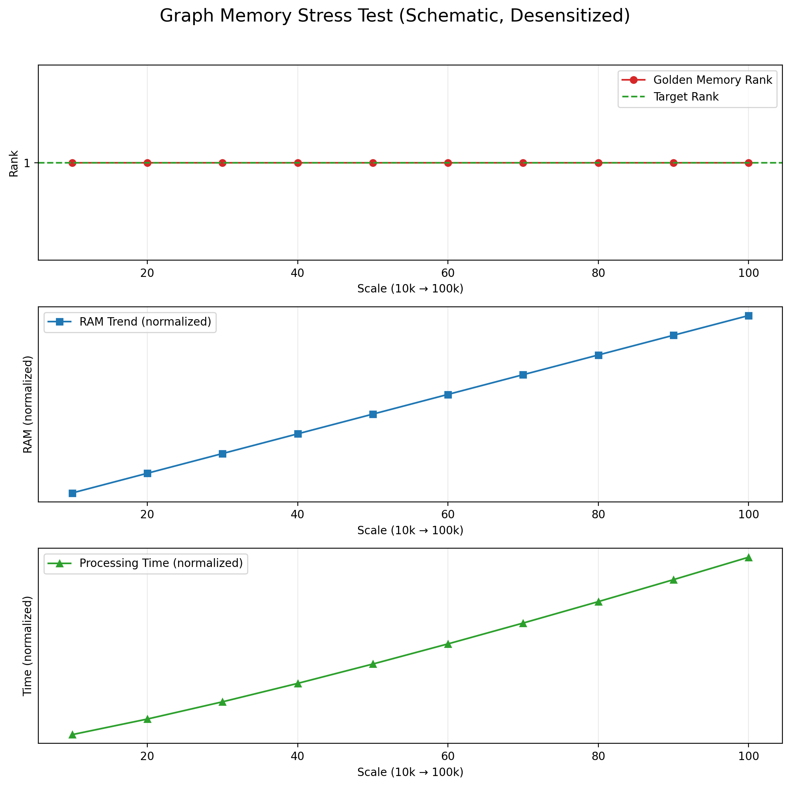
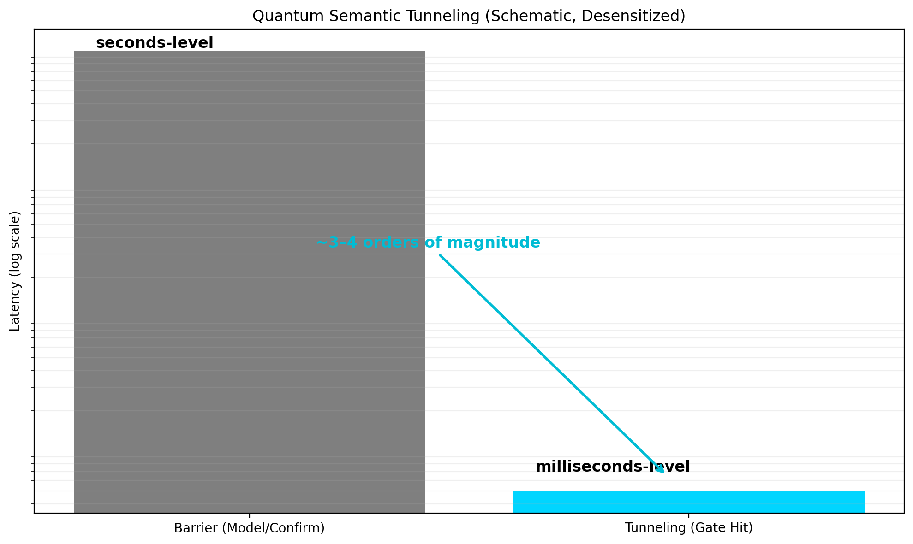

# 案例研究（脱敏版）| Case Studies (Desensitized)

> **目的**：展示我如何用"可复现证据"支撑技术主张。  
> **原则**：公开方法论与结论，不公开可复刻的核心实现。

---

## 案例 1：100k 节点图压测 | Graph Memory Stress Test

### 问题
当图谱规模增长到 10 万节点时，检索是否会"塌缩"（目标项排名快速下降或丢失）？

### 方法
- **Golden Memory**：固定的目标节点
- **压测规模**：从 1k → 100k 节点逐步插入
- **排名指标**：对所有节点计算余弦相似度并排序，记录目标节点排名

### 结论（脱敏）
- **Golden Memory Rank**：始终保持 **Rank=1**（未出现 retrieval collapse）
- **内存增长**：**41.51MB → 55.20MB**（近似线性）
- **端到端耗时**：**0.47s → 7.48s**（100k）

### 如何复核
技术评审时可屏幕共享完整实验日志、CSV 数据、图表。

---

## 案例 2：量子语义隧穿 | Quantum Semantic Tunneling

### 问题
能否在不调用 LLM 的情况下，将模糊自然语言意图直接映射为机器指令？

### 方法
- **HDC 共振门控**：用超向量（Hypervector）编码指令集合，计算输入与指令的共振分数
- **阈值门控**：Resonance > 0.735 时触发指令，否则回退到 LLM/确认
- **对照组**：LLM Barrier（真实 Ollama 本地模型）

### 结论（脱敏）
- **关键样例**：输入 *"Kill the lights"* → 目标 `CMD_LIGHTS_OFF`
  - Resonance: **0.7892**
  - 端到端延迟：LLM ≈ **9171ms** vs HDC ≈ **5.1ms**
  - 能量节省：**99.94%**

### 如何复核
技术评审时可演示共振门控命令行工具 + 对数刻度延迟对比图。

---

## 案例 3：门控延迟分布 | System 0/0.5 Gate Latency

### 问题
在消费级 CPU 上，门控（normalize → 共振检查 → 路由）的延迟分布是什么？

### 方法
- **测试规模**：200 次请求
- **测试条件**：`batch_size=200`, `simple_ratio=0.70`, `threshold=0.80`
- **Host latency 模拟**：~1200ms（+ 抖动）
- **Sidecar latency 模拟**：~1ms

### 结论（脱敏）
- **Mean gate overhead**: **4.190 ms**
- **P50**: **1.518 ms**
- **P95**: **10.879 ms**

### 如何复核
技术评审时可展示完整延迟分布图与 trace 日志。

---

## 更多案例

完整案例研究（含真实数据、可复刻配置、参数敏感性分析）在私有证据包，可在以下场景提供：
- 30 分钟技术评审（屏幕共享演示）
- 付费 PoC 启动后（按保密协议交付）

---

## 📞 如何评审

请邮件说明你们的链路与想优化的指标，我会安排 30 分钟线上评审，屏幕共享完整证据包。

Email: chenmoke2022@gmail.com

