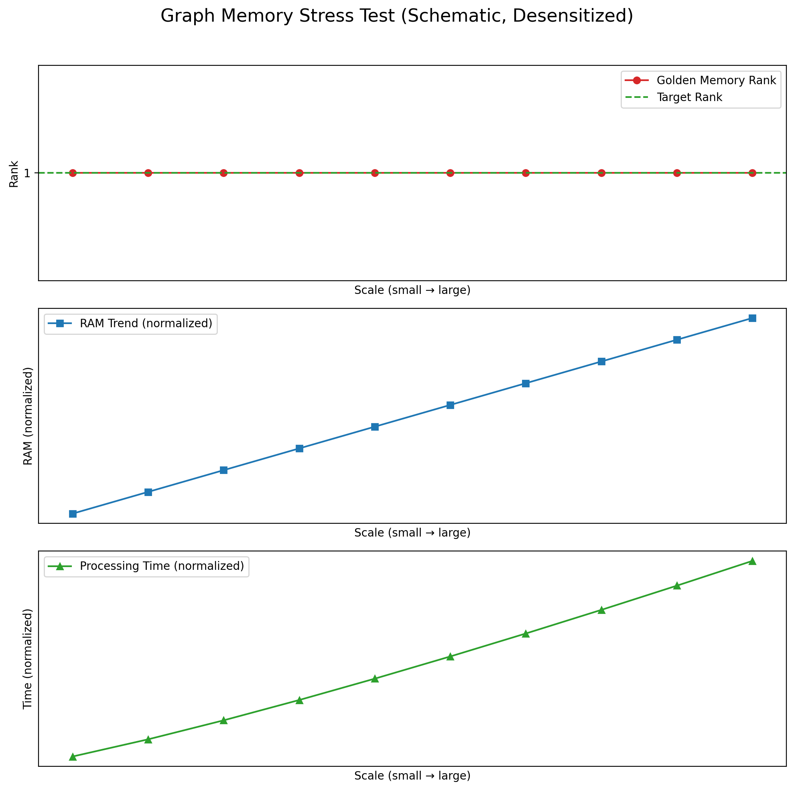

# 案例研究（脱敏版）| Case Studies (Desensitized)

> **目的**：展示我如何用"可复现证据"支撑技术主张。  
> **原则**：公开方法论与结论，不公开可复刻的核心实现。

---

## 案例 A：大规模图压测 | Graph Memory Stress Test

### 问题
当图谱规模增长到很大时，检索是否会"塌缩"（目标项排名快速下降或丢失）？

### 方法
- **Golden Memory**：固定的目标节点
- **压测规模**：逐步增加图谱规模（公开不写具体规模）
- **排名指标**：对所有节点计算余弦相似度并排序，记录目标节点排名

### 结论（脱敏）
- **Golden Memory Rank**：始终保持**首位**（未出现 retrieval collapse）
- **内存增长**：随规模近似线性增长（公开不写具体数）
- **端到端耗时**：随规模增长而增长（公开不写具体数）

### 如何复核
技术评审时可屏幕共享完整实验日志、CSV 数据、图表。

---

## 案例 B：量子语义隧穿 | Quantum Semantic Tunneling

### 问题
能否在不调用 LLM 的情况下，将模糊自然语言意图直接映射为机器指令？

### 方法
- **HDC 共振门控**：用超向量（Hypervector）编码指令集合，计算输入与指令的共振分数
- **阈值门控**：当共振分数超过“安全触发阈值”时触发指令，否则回退到模型/确认（阈值与规则不公开）
- **对照组**：Barrier 模式（本地模型推理/确认路径）

### 结论（脱敏）
- **关键样例**：输入 *"Kill the lights"* → 目标 `CMD_LIGHTS_OFF`
  - 触发结果：**命中预期指令**
  - 端到端延迟：Barrier（模型推理/确认）显著高于 Tunneling（门控命中）（公开不写具体数）
  - 能耗/成本：在同等链路下，Tunneling 模式显著更省（具体口径与测量方法在私有证据包）

### 如何复核
技术评审时可演示共振门控命令行工具 + 对比图（示意/公开版不含精确刻度）。

---

## 案例 C：门控延迟分布 | Gate Latency

### 问题
在消费级 CPU 上，门控（normalize → 共振检查 → 路由）的延迟分布是什么？

### 方法
- **测试规模**：多次请求采样，形成分布
- **测试条件**：固定一组代表性负载与门控策略（具体参数不公开）
- **对照**：将门控开销与“重推理/远程调用”等慢路径对比，强调量级差异

### 结论（脱敏）
- **门控开销**：整体为**极低开销**；尾部可控（完整分布在私有证据包）

### 如何复核
技术评审时可展示完整延迟分布图与 trace 日志。

---

## 更多案例

完整案例研究（含真实数据、可复刻配置、参数敏感性分析）在私有证据包，可在以下场景提供：
- 线上技术评审（屏幕共享演示）
- 付费 PoC 启动后（按保密协议交付）

---

## 📞 如何评审

请邮件说明你们的链路与想优化的指标，我会安排线上评审，屏幕共享完整证据包。

Email: chenmoke2022@gmail.com

